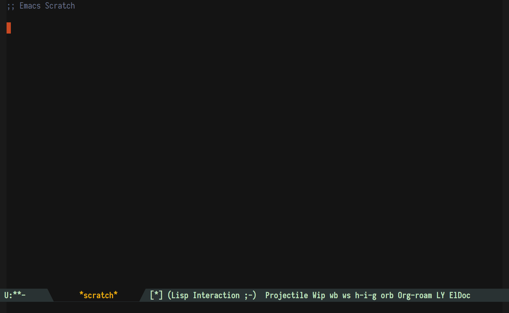

[](https://www.gnu.org/licenses/gpl-3.0)
[](https://github.com/org-roam/org-roam-bibtex/graphs/commit-activity)
[](https://github.com/org-roam/org-roam-bibtex/releases/)
[](https://melpa.org/#/org-roam-bibtex)

org-roam-bibtex
============


Description
---------------

Org Roam BibTeX (ORB) is an Org Roam extension that integrates [Org
Roam](https://github.com/jethrokuan/org-roam) with bibliography/citation
management software: [Org Ref](https://github.com/jkitchin/org-ref), [Helm and
Ivy BibTeX](https://github.com/tmalsburg/helm-bibtex) and
[Citar](https://github.com/bdarcus/citar).

It allows users to manage their bibliographical notes using Org Roam and access
the notes in `org-roam-directory` via `helm-bibtex`, `ivy-bibtex`,
`citar-open-notes` or by activation Org-ref `cite:` links and Org-cite
citations.

Quick Demonstration 🎬
---------------


See also [a somewhat outdated video demonstration of Org Roam
v0.2.1](https://www.youtube.com/watch?v=Wy9WvF5gWYg)

Articles
---------------
Here is a selection of articles that you may find interesting.

#### Introduction to Org-roam
- [How To Take Smart Notes With Org-mode](https://blog.jethro.dev/posts/how_to_take_smart_notes_org/) by [@jethrokuan](https://github.com/jethrokuan)

#### Workflow
- [An Orgmode Note Workflow](https://rgoswami.me/posts/org-note-workflow/) by [@HaoZeke](https://github.com/HaoZeke) (outdated).

Important news 
---------------------------------

**Org Roam BibTeX has been upgraded to v0.6, which is compatible with Org-roam
v2.  Please read carefully this README file and [the
manual](doc/orb-manual.org) and adjust your configuration files accordingly.
In particular, pay attention that the variable `orb-templates` has been
deprecated in favour of `org-roam-capture-templates`, which in Org-roam v2 has
a different list structure.  Consult [the manual](doc/orb-manual.org) for more
details**

Org Roam BibTeX v0.5.2 is the last version of ORB that works with Org-roam v1.
It can be found on the branch `orb-v0.5`.

A word of warning 🚧
---------------

`org-roam-bibtex` is in **Alpha**.

This means that a lot of things may change in the future (e.g. renaming
variables, rewriting functions).  As a result, the package will be unstable for
a while.  This will change when we release v1.0, but for now, you will have to
be on the lookout for a few things:

1. If you encounter a problem with the package, start by making sure that you
   have the latest version. (cf. [Installation](#installation))
2. If there is a problem with your configuration, most notably variables which
   do not exist anymore or functions which are not called with the right number
   of arguments, you will need to check this page to see what has changed.
3. If neither 1. nor 2. resolved your problem, read the following section on
   [how to get help](#orb-help-me).

<a name="orb-help-me"></a>Getting help
---------------

Please read carefully this section before installing Org Roam BibTeX.  We are
glad to help you in case something does not work as expected.  However, we
kindly ask you to follow these simple rules when asking for help:

1. Read carefully this README file.
2. Read it once again, please.  Consult the [extended manual](doc/orb-manual.org)
3. Check our [community resources](#community) and describe your problem there.
4. Open an issue on the bug tracker.
5. Take your time to describe your problem and we'll take ours to help you solve it.
6. Describe your problem clearly, in a procedural way: "I run `this command`,
then I run `that command`, and finally `this one`.  I expect `this` to happen
but instead happens `that`.  Here is my `configuration`."
7. Thank you!

Keep in mind that ORB is under active development and the configuration
snippets that you might have found somewhere in the Internet may be outdated
and be the actual cause your errors.  It is therefore highly recommended to use
this README file, [the manual](doc/orb-manual.org) and the Emacs built-in
docstrings as primary documentation sources.

Installation
---------------

### Hard dependencies

Org Roam BibTeX depends on [Org Roam](https://github.com/org-roam/org-roam) and
[BibTeX Completion](https://github.com/tmalsburg/helm-bibtex).  Users cloning
ORB directly from GitHub also need to install the above packages.  When
installing ORB with a package manager (MELPA) or from within a configuration
framework (Doom, Spacemacs), no additional steps are required.

### Soft dependencies

Some parts of Org Roam BibTeX will not work without: 

* [Org Ref](https://github.com/jkitchin/org-ref) — namely when Org-ref v2 or v3
  citation citation links are used as ROAM_REFS.  Org-roam and ORB now support
  the built-in Org-cite citation keys (Org mode version 9.5+), so Org-ref is
  not a strict requirement anymore.
* [Helm/Ivy-bibtex](https://github.com/tmalsburg/helm-bibtex) — these packages
  are required by Org-ref and provide native interfaces for Bibtex-completion,
  although the latter can be installed separately without them.
* [Citar](https://github.com/bdarcus/citar) — this package provides an extended
  support for Org-cite citations. You will need to install the companion
  package [Citar-org-roam](https://github.com/emacs-citar/citar-org-roam), and
  configure it as described
  [here](https://github.com/emacs-citar/citar/wiki/Notes-configuration#org-roam-bibtex).
* [AnyStyle CLI](https://github.com/inukshuk/anystyle-cli) — ORB PDF Scrapper
requires this external tool, see [Orb Anystyle](#orb-anystyle) for more
details.

* ORB offers basic completion functions based on Emacs native completion
  interfaces, but user experience can be enhanced with Helm, Ivy and Hydra
  packages.
* Users of Projectile and Persp-mode will be pleased to learn that ORB can
  automatically switch perspective to the Org Roam project when creating a
  note.

### With Emacs built-in package manager (`package.el`)

The package is on [MELPA](https://github.com/melpa/melpa).

1. Install `org-roam-bibtex`:

    a) using `package.el`:

    ```
    M-x package-install RET org-roam-bibtex RET
    ```

    b) Alternatively, install it with `M-x package-list-packages`.

2. Load and configure the package in your
[init-file](https://www.gnu.org/software/emacs/manual/html_node/emacs/Init-File.html):

    a) with `use-package`:

    ``` emacs-lisp
    (use-package org-roam-bibtex
      :after org-roam
      :config
      (require 'org-ref)) ; optional: if using Org-ref v2 or v3 citation links
    ```

    b) Alternatively, require the package if you don't use `use-package`:

    ``` emacs-lisp
    (require 'org-ref) ; optional: if using Org-ref v2 or v3 citation links
    (require 'org-roam-bibtex)
    ```

### Via cloning

You can also clone the repository somewhere in your `load-path`.  If you would
like to assist with development, this is the way to go.

To do that:

1. Create a directory where you’d like to clone the repository, e.g. `mkdir
   ~/projects`.

2. `cd ~/projects`

3. `git clone https://github.com/org-roam/org-roam-bibtex.git`

4. Load and configure the package:

    a) with `use-package`:

    ```emacs-lisp
    (use-package org-roam-bibtex
      :after org-roam
      :load-path "~/projects/org-roam-bibtex/" ; Modify with your own path where you cloned the repository
      :config
      (require 'org-ref)) ; optional: if using Org-ref v2 or v3 citation links
    ```

    b) Alternatively, if you don't use `use-package`: 

    ```emacs-lisp
    (require 'org-ref) ; optional: if using Org-ref v2 or v3 citation links
    (add-to-list 'load-path "~/projects/org-roam-bibtex/") ; Modify with your own path where you cloned the repository
    (require 'org-roam-bibtex)
    ```

### Spacemacs

If you have a private `org-roam` layer, modify it as follows:

``` emacs-lisp
(defconst org-roam-packages
  '(org-roam org-roam-bibtex))

 ;; add this after `org-roam/init-org-roam`:

(defun org-roam/init-org-roam-bibtex ()
  (use-package org-roam-bibtex
    :after org-roam
    :config
    (require 'org-ref)) ; optional: if using Org-ref v2 or v3 citation links
```

If you don't have a private `org-roam` layer, configure it first, see examples
[here](https://org-roam.discourse.group/t/orb-helm-bibtex-open-notes-wont-create-new-note/690)
and
[here](https://www.reddit.com/r/emacs/comments/f6erh0/total_noob_how_do_i_install_orgroam_in_spacemacs/).

Recent versions of Spacemacs ship with a built-in `org-roam` support, so you
won't need a private `org-roam` layer.  You still need a private layer for
`org-roam-bibtex`.  Consult Spacemacs documentation on how to create one, or
use the approach described in the above mentioned resources.

### Doom Emacs

1. Put this in `$DOOMDIR/packages.el`:

``` emacs-lisp
(package! org-roam-bibtex
  :recipe (:host github :repo "org-roam/org-roam-bibtex"))

;; When using org-roam via the `+roam` flag
(unpin! org-roam)

;; When using bibtex-completion via the `biblio` module
(unpin! bibtex-completion helm-bibtex ivy-bibtex)
```

2. Put this in `$DOOMDIR/config.el`: 

``` emacs-lisp
(use-package! org-roam-bibtex
  :after org-roam
  :config
  (require 'org-ref)) ; optional: if using Org-ref v2 or v3 citation links
```

3. Run `bin/doom sync -u` and restart Emacs.

Usage
---------------

#### `org-roam-bibtex-mode`

Call interactively `org-roam-bibtex-mode` or arrange your init file to perform
this automatically.

You can now access your bibliographical notes in `org-roam-directory` with
`helm-bibtex`/`ivy-bibtex` or by opening `org-ref` links.  ORB modifies the
behaviour of the above packages to make them use `orb-edit-note` instead of
their default note-management commands.  To get their default behaviour back,
disable `org-roam-bibtex-mode`.

#### `orb-note-actions`

Type `M-x orb-note-actions` to easily access additional commands useful in
note's context.  These commands are run with the note's BibTeX key as an
argument. The key is taken from the `:ROAM_REFS:` file or heading property.

#### `orb-insert-link`

Select a bibliography entry and insert a link to a note associated with it.  If
the note does not exist yet, create it.  Similar to `org-roam-node-insert`, if a
region is selected, it becomes the link description.

Configuration
---------------

See [the Org Roam BibTeX Manual](doc/orb-manual.org) for configuration options and
advanced usage.

Community
---------------
For help, support, or if you just want to
hang out with us, you can find us here:

* **IRC**: channel **#org-roam** on [Libera Chat](https://libera.chat/guides/connect)
* **Slack**: channel **#org-roam-bibtex** on [Org Roam](https://join.slack.com/t/orgroam/shared_invite/zt-deoqamys-043YQ~s5Tay3iJ5QRI~Lxg)
* **Discourse**: [Org Roam Discourse group](https://org-roam.discourse.group)

Changelog
---------------
Changelog is being maintained [here](https://github.com/org-roam/org-roam-bibtex/blob/master/CHANGELOG.md).

License
---------------
Copyright © 2020-2022 Mykhailo Shevchuk

Copyright © 2020 Leo Vivier

And contributros.

Distributed under the GNU General Public License , see [LICENSE](LICENSE).
